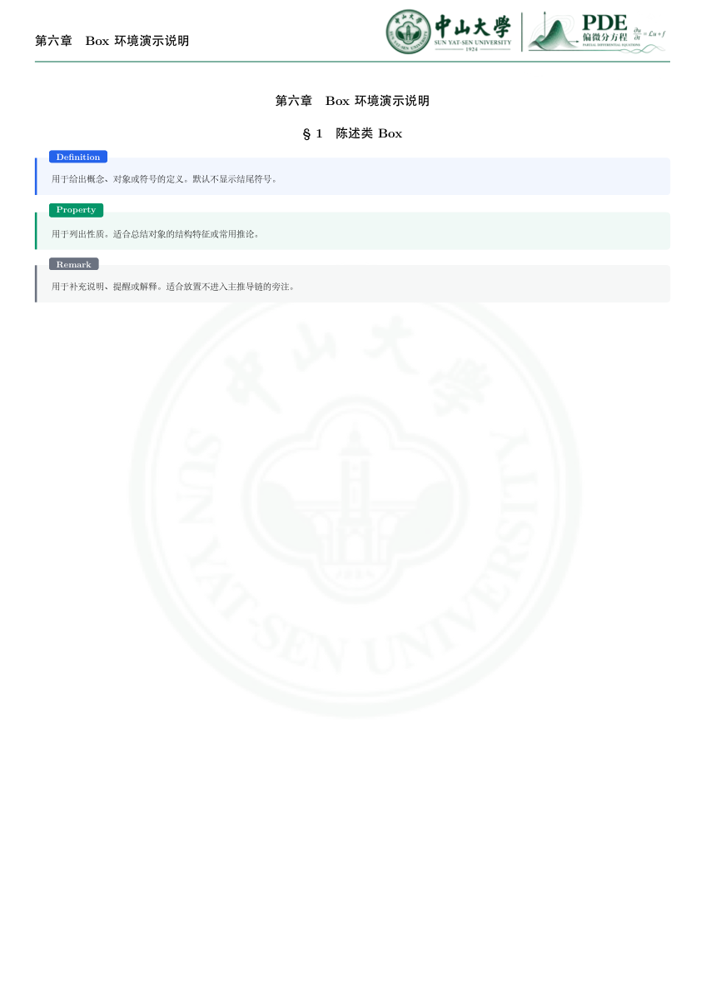
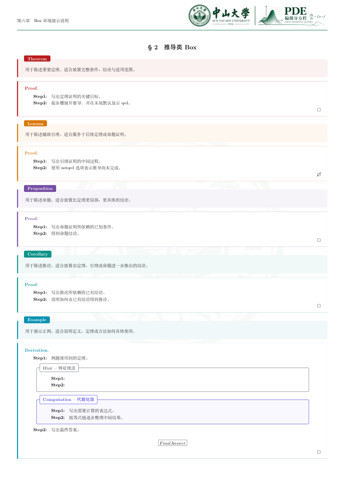
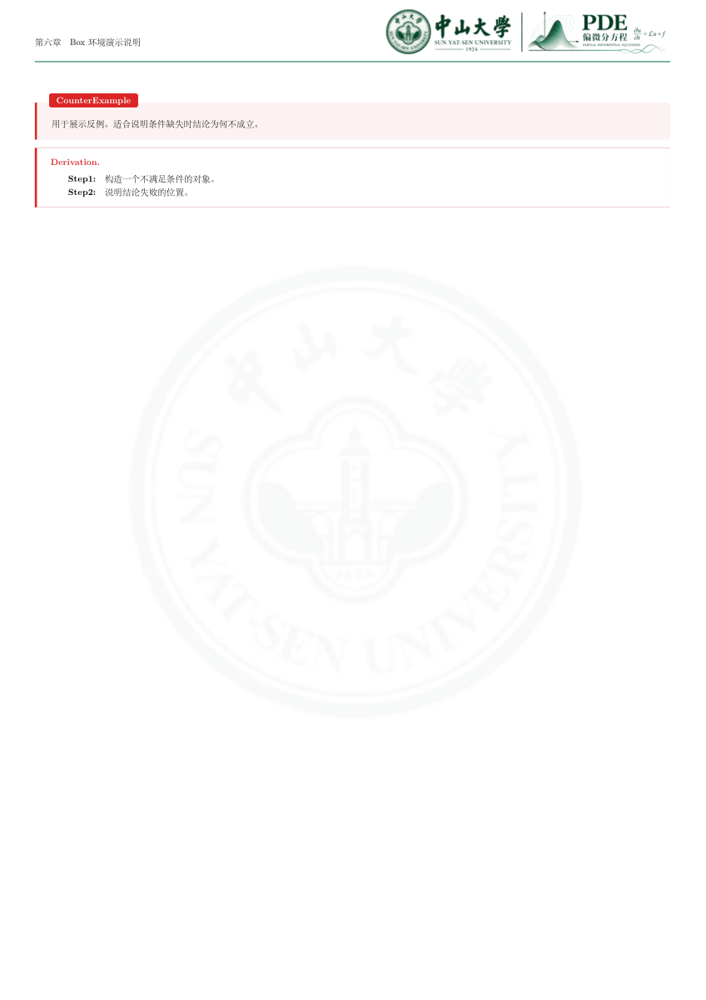
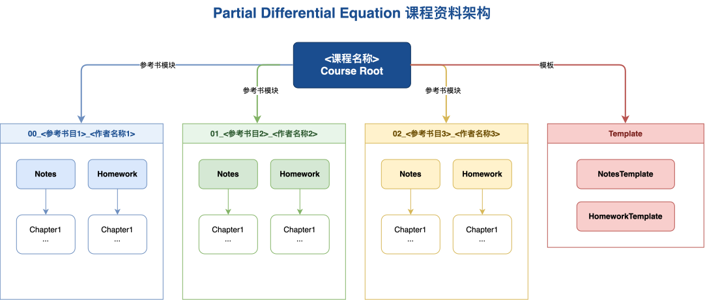

# PartialDifferentialEquations

偏微分方程（PDE）课程资料仓库 — 姜礼尚教材笔记与习题。

## Structure

```
PartialDifferentialEquations/
├── main.tex
├── 00-Course/              # 课程信息 / 大纲 / 课程地图
├── 01-Textbooks/
│   └── 00-姜礼尚/          # 教材：姜礼尚《偏微分方程》
│       ├── main.tex
│       ├── 01-Notes/       # 笔记（5 章 × 节 × 小节）
│       └── 02-Homework/    # 习题（镜像笔记结构）
├── 02-Template/            # NotesTemplate / HomeworkTemplate
├── 03-Figures/             # 00-姜礼尚 配图
├── 04-References/          # references.bib
└── Settings/               # PackageSet / EnvironmentSet
```

## Chapters（姜礼尚）

<div align="center">

| 章 | 内容 | 页 |
|:---:|:---:|:---:|
| 第一章 | 方程的导出和定解条件 | P1 |
| 第二章 | 波动方程 | P31 |
| 第三章 | 热传导方程 | P108 |
| 第四章 | 位势方程 | P169 |
| 第五章 | 二阶线性偏微分方程的分类 | P221 |

</div>

## Figures

<p align="center">
  
</p>

<p align="center">
  
</p>

<p align="center">
  
</p>

## Latex Playground Preview

Page 10 and Page 11 PDFs were refreshed from the latest local extraction.

<table>
  <tr>
    <td align="center" width="33%">
      
      <br />
      <a href="03-Figures/latex-playground-pages/main-page-9.pdf">Download Page 9 PDF</a>
    </td>
    <td align="center" width="33%">
      
      <br />
      <a href="03-Figures/latex-playground-pages/main-page-10.pdf">Download Page 10 PDF</a>
    </td>
    <td align="center" width="33%">
      
      <br />
      <a href="03-Figures/latex-playground-pages/main-page-11.pdf">Download Page 11 PDF</a>
    </td>
  </tr>
</table>

## Course Architecture

<p align="center">
  
</p>

## Build

```bash
cd 01-Textbooks/00-姜礼尚 && xelatex main.tex
```

## License

## Contributors
